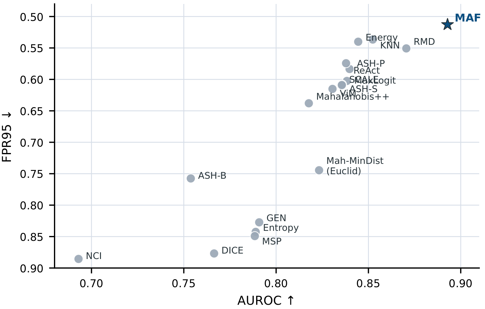
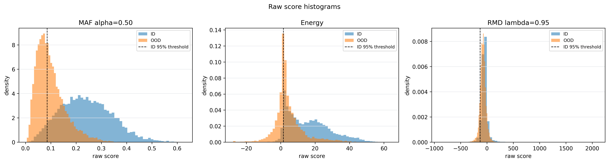
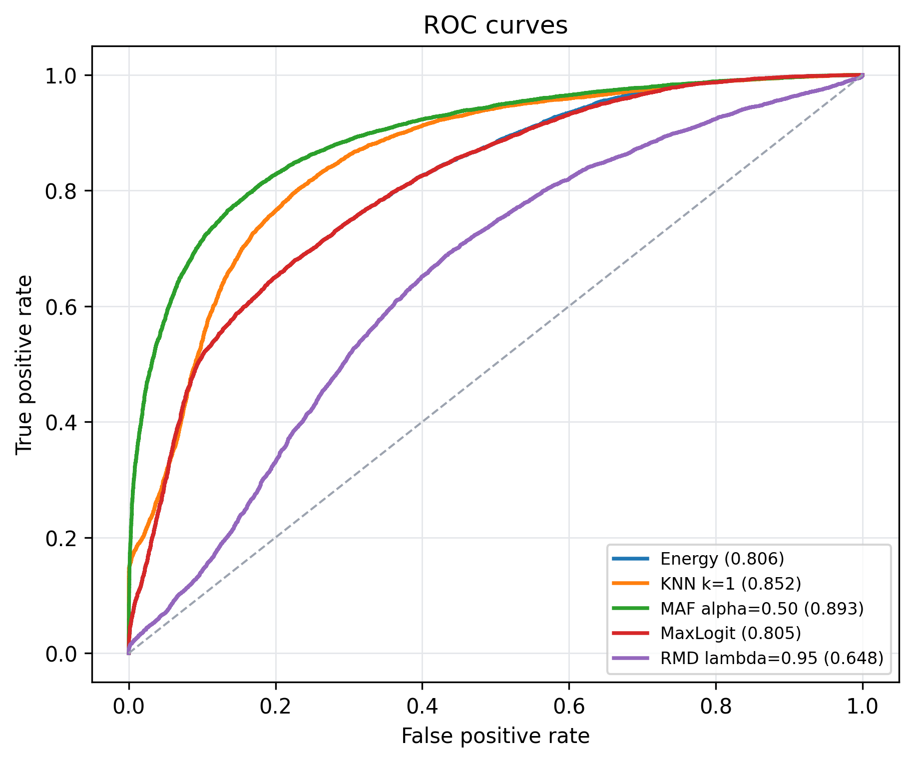
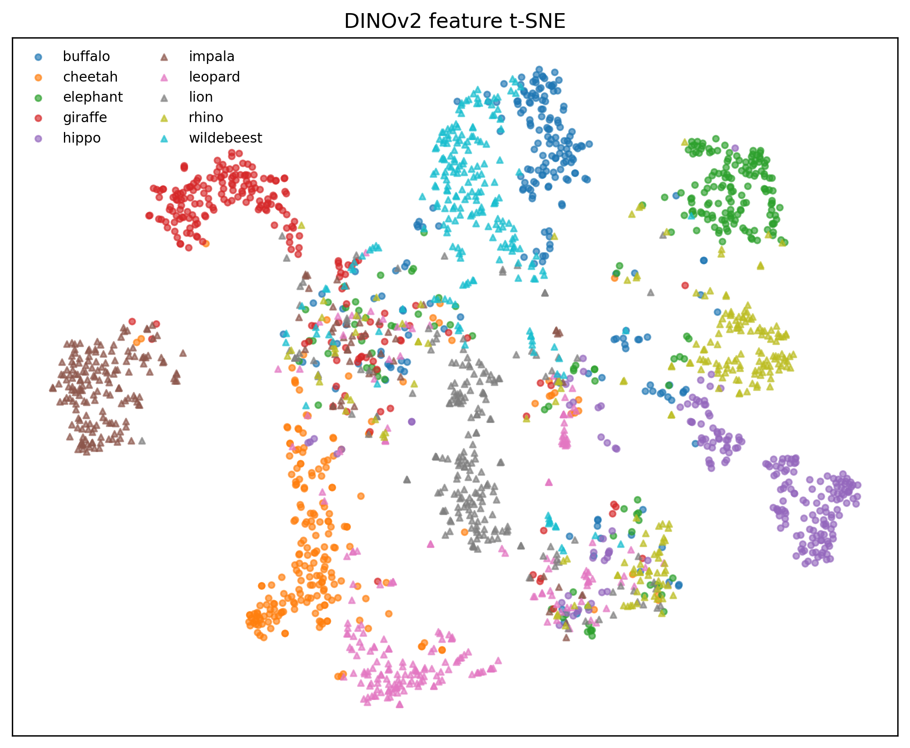

# MAF: 特徴空間のMahalanobis幾何に基づく野生動物画像のUltra-Near-OoD検知

# 慶應義塾大学3年　表 紘太朗 (Keio University B3, Kotaro Omote)

研究会では各自をログインネームで呼ぶ＆書く文化があります。悪しからずご了承ください。

Reproducible implementation for **Mahalanobis Affinity Fusion (MAF)**, a feature-space Ultra-Near-OoD detector for wildlife images.

**Report PDF:** [MAF: 特徴空間のMahalanobis幾何に基づく野生動物画像のUltra-Near-OoD検知](docs/main.pdf)

This repository is intentionally small. It keeps only the implementation needed to reproduce the paper experiments and removes notebooks, report build artifacts, server-specific wrapper scripts, and temporary ablation code.

## Method

For an input image \(x\), a frozen backbone extracts a feature \(f(x)\). For each ID class \(c\), MAF computes a Mahalanobis distance

\[
q_c(x) = (f(x)-\mu_c)^\top \Sigma^{-1}(f(x)-\mu_c), \qquad
d_c(x)=\sqrt{\max(q_c(x),0)}.
\]

The paper setting uses **tied covariance** estimated from ID validation features with Ledoit-Wolf shrinkage. Distances are converted to a class-affinity distribution:

\[
p_c(x;\tau)=\frac{\exp(-d_c(x)/\tau)}{\sum_{j=1}^{K}\exp(-d_j(x)/\tau)}.
\]

Then

\[
C(x)=\max_c p_c(x;\tau), \qquad
G(x)=1-\frac{-\sum_{c=1}^{K}p_c(x;\tau)\log(p_c(x;\tau)+\epsilon)}{\log K}.
\]

The final fixed MAF score is

\[
S_{\mathrm{MAF}}(x)=
\operatorname{clip}(C(x),\epsilon,1)^{\alpha}
\times
\operatorname{clip}(G(x),\epsilon,1)^{1-\alpha}.
\]

Higher scores mean more ID-like. The reproducible main setting is:

- backbone: `dinov2_vitb14`
- feature: raw CLS feature, no L2 normalization
- covariance: tied covariance
- estimator: Ledoit-Wolf
- \(\tau=1.0\)
- \(\alpha=0.50\)
- no test-OOD oracle tuning

## Dataset Layout

The WILD_DATA split used in the paper is expected outside the repository and is available here:

```text
https://drive.google.com/drive/folders/1LCdZnAN6gWIv_Ds0bTWLipD6jjptLAgj?usp=sharing
```

```text
WILD_DATA/splits/
  train/id/{buffalo,cheetah,elephant,giraffe,hippo}/
  val/id/{buffalo,cheetah,elephant,giraffe,hippo}/
  test/id/{buffalo,cheetah,elephant,giraffe,hippo}/
  test/ood/{impala,leopard,lion,rhino,wildebeest}/
```

`val/ood` is not used by the main MAF setting.

See [docs/dataset.md](docs/dataset.md) for dataset notes.

## Install

Create an environment and install dependencies. Install PyTorch for your CUDA version first; the line below is the Hades setting used for the reported runs.

```bash
python -m venv .venv
source .venv/bin/activate
python -m pip install --upgrade pip
pip install torch==2.6.0 torchvision==0.21.0 --index-url https://download.pytorch.org/whl/cu126
pip install -e .
```

CPU-only installation can run unit tests and cached-feature scoring, but full image feature extraction is intended for a GPU.

For a pinned submission environment, see [environment.yml](environment.yml), [requirements-lock.txt](requirements-lock.txt), and [docs/environment.md](docs/environment.md).

The DINOv2 feature extractor is pinned to Meta's official repository:

```text
repository: facebookresearch/dinov2
model: dinov2_vitb14
git ref: 7b187bd4df8efce2cbcbbb67bd01532c19bf4c9c
```

## Reproduce From Cached Features

If `analysis_v3.npz` files already exist:

```bash
python scripts/run_cached_features.py \
  --artifact-root /home/omote/maf_ood_v51 \
  --backbone dinov2_vitb14 \
  --seeds 42 123 456 \
  --output results/dinov2_cached
```

Expected input layout:

```text
/home/omote/maf_ood_v51/dinov2_vitb14/seed42/analysis_v3.npz
/home/omote/maf_ood_v51/dinov2_vitb14/seed123/analysis_v3.npz
/home/omote/maf_ood_v51/dinov2_vitb14/seed456/analysis_v3.npz
```

Each NPZ should contain at least:

```text
val_features, val_labels, id_features, ood_features
```

Optional logit baselines additionally use:

```text
id_logits, ood_logits
```

When logits are created from cached raw features, this repository uses the paper
setting: a one-layer frozen-feature classifier `Linear(d->K)` with no hidden
layer. For DINOv2-ViT-B/14 on WILD_DATA this is `Linear(768->5)`.

Outputs:

```text
results/dinov2_cached/per_seed.csv
results/dinov2_cached/summary.csv
results/dinov2_cached/config.json
```

## Extract DINOv2 Features From Images

To build a cached feature file from the WILD_DATA folders:

```bash
python scripts/extract_wild_dinov2.py \
  --data-root /home/omote/WILD_DATA/splits \
  --output /home/omote/maf_ood_v51/dinov2_vitb14/seed42/analysis_v3.npz \
  --seed 42 \
  --device cuda
```

Then run `scripts/run_cached_features.py` on the created artifact.

## Reported Reference Result

On WILD_DATA with DINOv2-ViT-B/14 and three seeds, the fixed MAF setting above gave:

| Method | AUROC | AUPR-IN | AUPR-OUT | FPR95 | AUTC |
| --- | ---: | ---: | ---: | ---: | ---: |
| MAF, tied LW, alpha=0.50 | 0.8928 | 0.9002 | 0.8793 | 0.5128 | 0.7734 |

The repository also includes ablation hooks for `s_conf only`, `s_cons only`, arithmetic fusion, class-wise covariance, empirical covariance, Euclidean fusion, Mahalanobis minimum distance, RMD, KNN, MSP, Entropy, Energy, and MaxLogit.

Baseline equations and implementation differences are documented in [docs/baselines.md](docs/baselines.md). Exploratory choices and oracle/analysis-only settings are documented in [docs/model_selection.md](docs/model_selection.md).

## Result Figures

Selected result figures are included under [docs/figures](docs/figures). These are intended for quickly checking the reported behavior without opening the full PDF.

| Main comparison | Score distribution |
| --- | --- |
|  |  |

| ROC / PR curves | Feature geometry |
| --- | --- |
|  |  |

Additional backbone, ablation, covariance, and species-level figures are listed in [docs/figures/README.md](docs/figures/README.md).

## Repository Structure

```text
src/maf01/
  maf.py          # MAF statistics, distances, components, fusion scores
  metrics.py      # AUROC, AUPR-IN, AUPR-OUT, FPR95, AUTC
  baselines.py    # MSP, Entropy, Energy, MaxLogit, KNN, RMD, Mah-MinDist
  io.py           # cached feature NPZ loading/saving
  data.py         # WILD_DATA image datasets and transforms
  features.py     # DINOv2 feature extraction and a Linear(d->K) logit head
scripts/
  extract_wild_dinov2.py
  run_cached_features.py
configs/
  wild_data_dinov2.yaml
docs/
  method.md
  dataset.md
  environment.md
  baselines.md
  model_selection.md
  figures/       # selected result figures and analysis plots
tests/
  smoke_test.py
```
